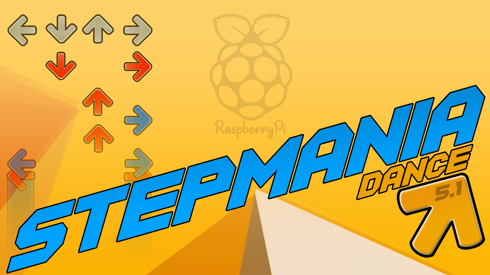

StepMania Arcade on Raspberry Pi
=========================

Scripts & instructions to turn a Raspberry Pi running Raspbian into a [StepMania](https://github.com/stepmania/stepmania) arcade console.

We've Moved
=========================

More than just the Raspberry Pi 3B is supported; go check out [SpottyMatt/raspbian-stepmania-arcade](https://github.com/SpottyMatt/raspbian-stepmania-arcade)!

